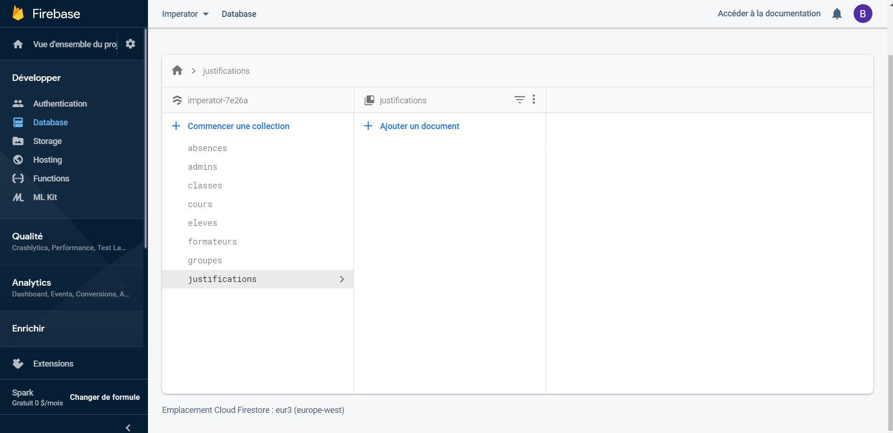

# ClassroomRegister - L'école multimédia

## Démo : [Lien](https://portfolio-bastien-chantrel.000webhostapp.com/index.html)


## Consignes

Nous devions réaliser une application web qui permet de gérer au mieux la présence des étudiants en classe.

Cette application doit être utile pour les étudiants, les formateurs et l’école.

Les questions auxquelles notre application doit répondre au minimum sont les suivantes :

1. En temps qu’étudiant, comment avertir le formateur de mon retard ou de mon absence.

2. En temps que formateur, comment noter les étudiants présents/absents/en retard sans perdre de temps en début de cours

3. Pour l’école, comment avoir accès à une synthèse permettant de connaître les étudiants présents, absents ou en retard par classe, par élève.


## Développé avec :

* [SSB - Admin 2 ](https://github.com/BlackrockDigital/startbootstrap-sb-admin-2) - Template
*  [jQuery](https://jquery.com/) - Bibliothèque / Librairie
*  [FullCalendar](https://fullcalendar.io/) - API pour le calendrier
*  [Cloud Firestore](https://firebase.google.com/docs/firestore) - Base de données

## Prérequis :


###### Créer une base de données cloud firestore :




###### Puis ajouter la firebaseConfig de votre base de données au projet ainsi que l'année actuelle dans [all_tools.js](https://github.com/BastosC/Bascent/blob/master/js/all_tools.js)

```javascript
const firebaseConfig = {
    apiKey: "",
    authDomain: "",
    databaseURL: "",
    projectId: "",
    storageBucket: "",
    messagingSenderId: "",
    appId: ""
};
firebase.initializeApp(firebaseConfig);
const db = firebase.firestore()
const annee = '2019-2020'
```

# Présentation :

#### [- Espace Connexion](#espace-connexion)
#### [- Espace Élève](#espace-eleve)
#### [- Espace Formateur](#espace-formateur)
#### [- Espace Administrateur](#espace-administrateur)
#### [- Mot de passe oublié](#espace-password)
#### [- Retour à l'espace connexion](#espace-refresh)

<hr>


<h1><a name="espace-connexion">Espace Connexion :</a></h1>


###### [HTML](https://github.com/BastosC/Bascent/blob/master/index.html) / [Javascript](https://github.com/BastosC/Bascent/blob/master/js/login.js)
###### L'espace connexion permet de se connecter avec ses identifiants en sélectionnant le poste correspondant, l'utilisateur peux accéder à la page pour retrouver son mot de passe


<h1><a name="espace-eleve">Espace Eleve</a></h1>

### Fonctionalités : 
* Consulter son nombre absences
* Consulter son emploi du temps
* Consulter le statut du cours ( savoir si le cours a démarré )
* Il peux justifier ses absences
* Consulter les messages importants de la classe
* Contacter un formateur en cas de retard occasionnel


### Pages : 


#### Espace élève : [HTML](https://github.com/BastosC/Bascent/blob/master/espace_eleve.html) / [Javascript](https://github.com/BastosC/Bascent/blob/master/js/eleve.js)


##### NB :  L'espace élève est consultable sur mobile, pour plus de facilité pour les élèves

<h1><a name="espace-formateur">Espace Formateur</a></h1>


### Fonctionalités : 
* Démarrer les cours prévu pour aujourd'hui
* Consulter son emploi du temps
* Consulter ses cours à venir
* Démarrer un cours, le mettre en pause et finir le cours 
* Mettre un élève en présent, retard, absent

### Pages : 


#### Espace formateur : [HTML](https://github.com/BastosC/Bascent/blob/master/espace_formateur.html) / [Javascript](https://github.com/BastosC/Bascent/blob/master/js/formateur.js)
* Démarrer les cours prévu pour aujourd'hui
* Consulter son emploi du temps
* Consulter ses cours à venir


#### Espace Formateur - Cours : [HTML](https://github.com/BastosC/Bascent/blob/master/espace_formateur_cours.html) / [Javascript](https://github.com/BastosC/Bascent/blob/master/js/formateur_cours.js)
* Démarrer un cours, le mettre en pause et finir le cours 
* Mettre un élève en présent, retard, absent


<h1><a name="espace-administrateur">Espace Administrateur</a></h1>

### Fonctionalités : 
* Consulter la liste des utilisateurs
* Consulter les absences et justifications
* Accepter ou refuser justifications

* Ajouter un utilisateur
* Modifier un utilisateur

* Ajouter une classe
* Modifier une classe

* Ajouter un cours
* Modifier un cours

### Pages : 


#### Espace Administrateur - Utilisateurs : [HTML](https://github.com/BastosC/Bascent/blob/master/espace_admin_utilisateurs.html) / [Javascript](https://github.com/BastosC/Bascent/blob/master/js/admin_utilisateurs.js)
* Consulter la liste des utilisateurs

#### Espace Administrateur - Justifications & absences : [HTML](https://github.com/BastosC/Bascent/blob/master/espace_admin_justifications.html) / [Javascript](https://github.com/BastosC/Bascent/blob/master/js/admin_justifications.js)
* Consulter les absences et justifications
* Accepter ou refuser justifications

#### Espace Administrateur - Ajouter utilisateur : [HTML](https://github.com/BastosC/Bascent/blob/master/espace_admin_utilisateur_ajouter.html) / [Javascript](https://github.com/BastosC/Bascent/blob/master/js/admin_utilisateur_ajouter.js)
* Ajouter un utilisateur

#### Espace Administrateur - Modifier utilisateur : [HTML](https://github.com/BastosC/Bascent/blob/master/espace_admin_utilisateur_modifier.html) / [Javascript](https://github.com/BastosC/Bascent/blob/master/js/admin_utilisateur_modifier.js)
* Modifier un utilisateur

#### Espace Administrateur - Ajouter classe : [HTML](https://github.com/BastosC/Bascent/blob/master/espace_admin_classes.html) / [Javascript](https://github.com/BastosC/Bascent/blob/master/js/admin_classes.js)
* Ajouter une classe

#### Espace Administrateur - Modifier classe : [HTML](https://github.com/BastosC/Bascent/blob/master/espace_admin_classe_modifier.html) / [Javascript](https://github.com/BastosC/Bascent/blob/master/js/admin_classe_modifier.js)
* Modifier une classe

#### Espace Administrateur - Ajouter cours : [HTML](https://github.com/BastosC/Bascent/blob/master/espace_admin_cours.html) / [Javascript](https://github.com/BastosC/Bascent/blob/master/js/admin_cours.js)
* Ajouter un cours

#### Espace Administrateur - Modifier cours : [HTML](https://github.com/BastosC/Bascent/blob/master/espace_admin_cours_modifier.html) / [Javascript](https://github.com/BastosC/Bascent/blob/master/js/admin_cours_modifier.js)
* Modifier un cours


<h1><a name="espace-password">Mot de passe oublié</a></h1>

### Fonctionalités : 
* Envoyer le mot de passe par e-mail


<!-- #### [HTML](https://github.com/BastosC/Bascent/blob/master/forgot-password.html) / [Javascript](https://github.com/BastosC/Bascent/blob/master/js/forgot_password.js) -->
#### L'espace 'Mot de passe oublié' permet de recuperer son mot de passe en rentrant son identifiant, le mot de passe sera envoyé à l'adresse e-mail liée à l'identifiant


<h1><a name="espace-refresh">Retour à l'espace connexion</a></h1>


<!-- #### [HTML](https://github.com/BastosC/Bascent/blob/master/lost_connection.html) / [Javascript](https://github.com/BastosC/Bascent/blob/master/js/forgot_password.js) -->
#### La page 'Retour à l'espace connexion' se déclenche si l'utilisateur tente de se connecter sans passer par l'espace connexion, cette page renvoie l'utilisateur sur l'espace connection après 2,5 secondes . Cela assure la sécurité des fonctionalitées réservées à un certain poste .


## Auteurs

* **Bastien CHANTREL** - *Developpement work* - [BastosC](https://github.com/BastosC)
* **Vincent PAPIN** - *Developpement work* - [Vincent-PAPIN](https://github.com/Vincent-PAPIN)


## License

This project is licensed under the MIT License - see the [LICENSE.md](LICENSE.md) file for details


